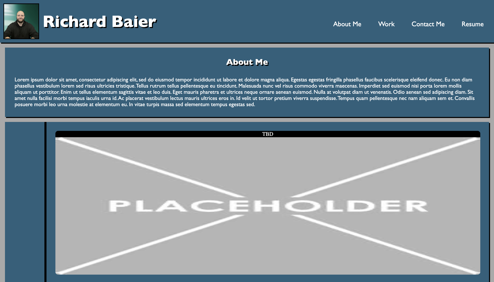
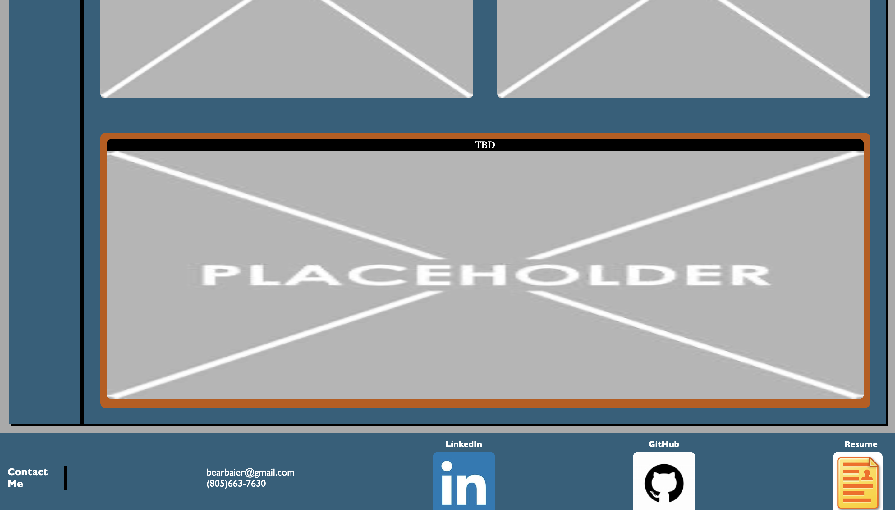

### Design
This website is the first portfolio site, which will be lacking in projects but shows the necessary plans for a future site.  It has a functioning navigation bar, which scrolls to desired locations, a list of projects, and a contact section at the bottom.

## Screenshots

## Links
GitHub: https://github.com/RichardBaier/Challenge02
Deployed Site: https://richardbaier.github.io/Challenge02/

